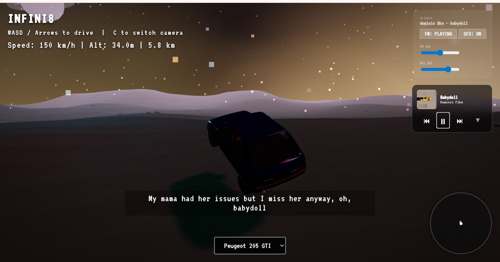
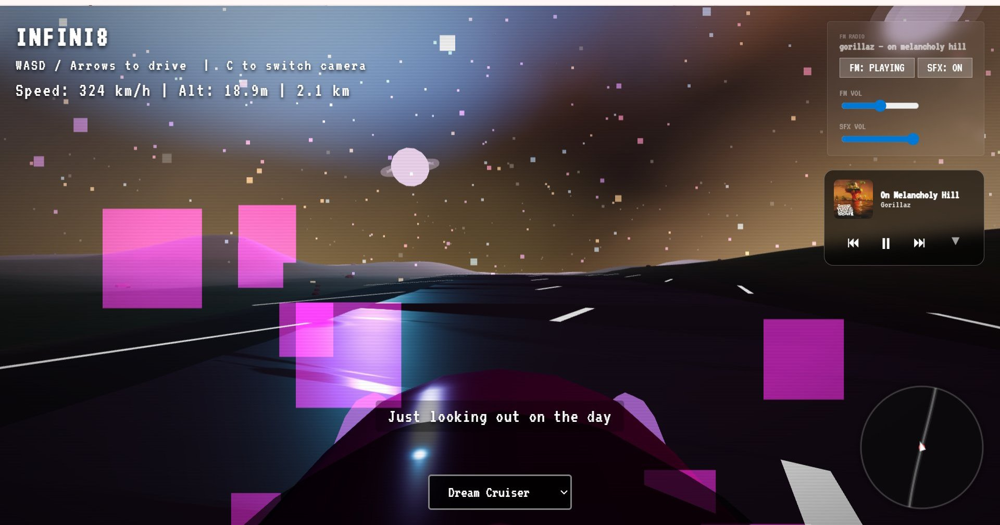
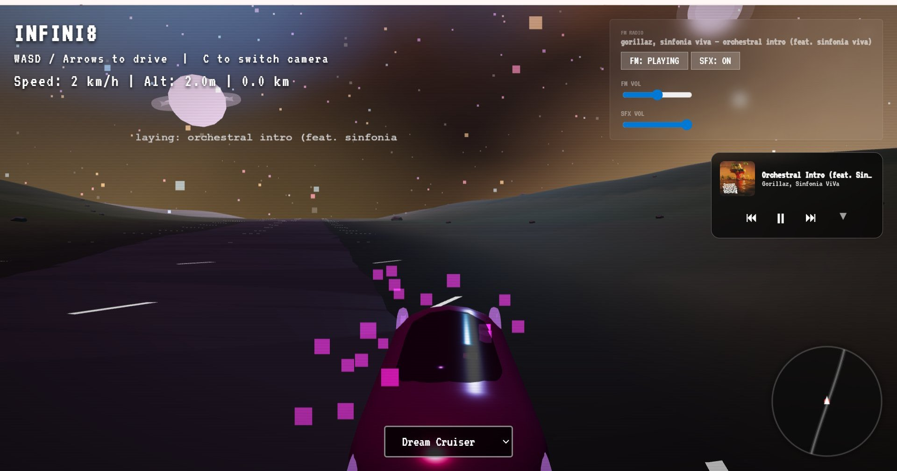
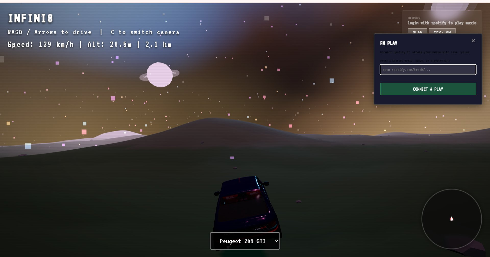
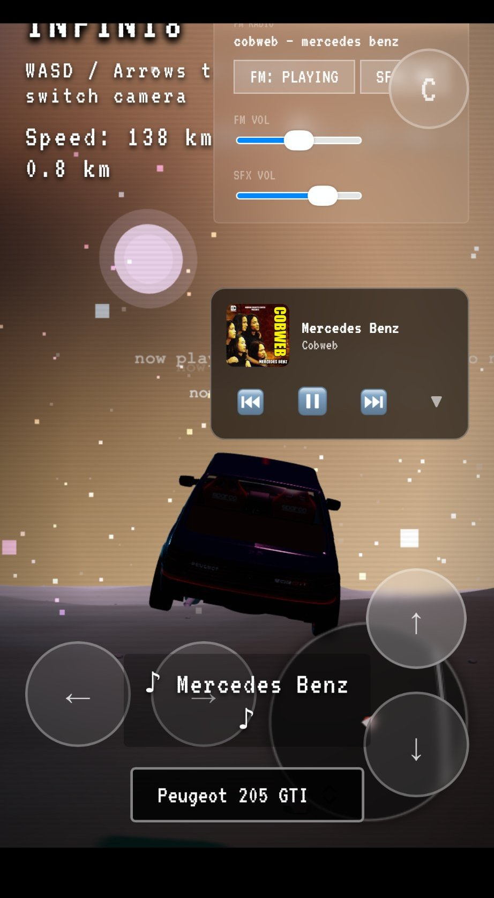
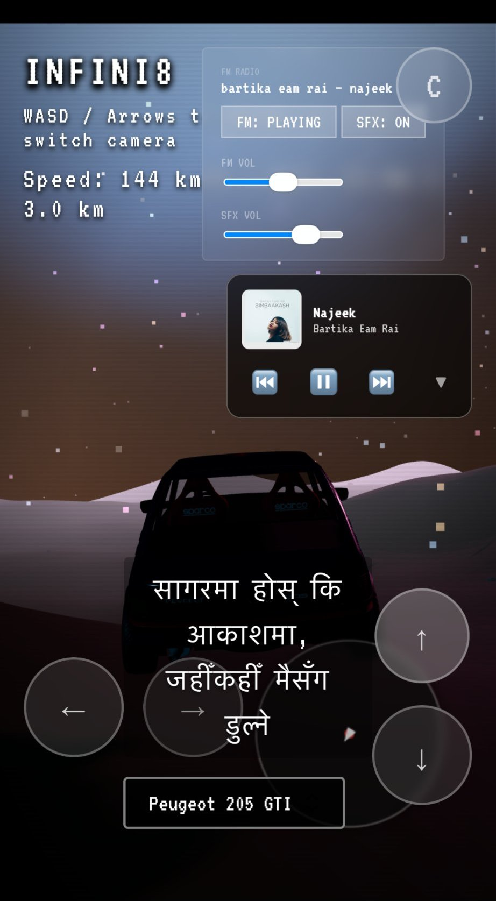
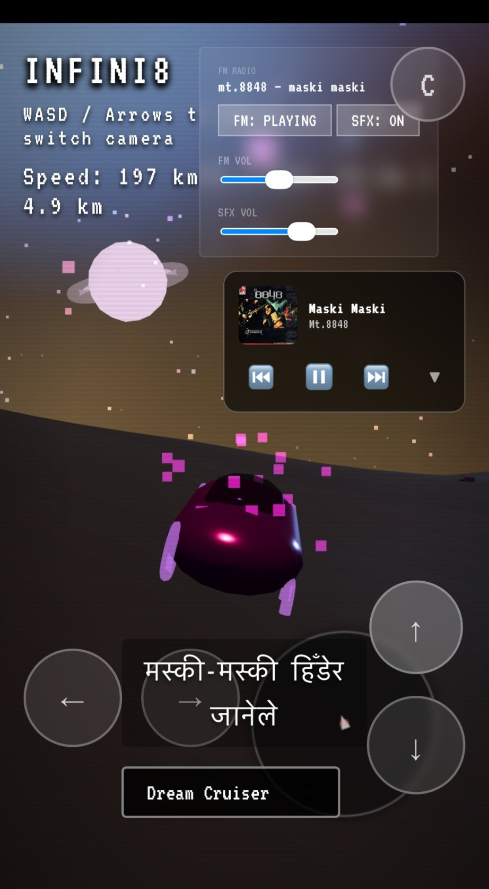

# INFINI8

---

### [Launch INFINI8](https://infini8.sandeshbhandari.com/)

---

## What is INFINI8?

INFINI8 is a browser-based driving experience built on [Three.js](https://threejs.org/). You pick a car, connect your Spotify, and drive. The road ahead never ends and the world never repeats because every piece of it is generated from scratch as you move through it. There are no objectives, no timers, no checkpoints, and no destination. You just drive, listen to music, and watch the landscape unfold around you forever.

Unlike anything else available in the browser today, the world is fully infinite and procedurally generated in real time using fractional Brownian motion, meaning the terrain, road curvature, celestial objects, ambient particles, and scattered world geometry all form themselves on the fly as you drive. You can go for hours and the road keeps going. Load times are instant because there is nothing to load.

---

## Features

### Infinite Procedural World

The terrain is generated in real time using layered noise functions so no two stretches of road are ever the same. The road curves naturally through rolling hills and the coordinate system shifts silently in the background so you can drive indefinitely without any hitching or loading pauses. The skies are designed by me and I've been hugely inspired by weirdcore aesthetics and tried to make it as close to that as possible and pretty. Stars, planets, ambient particles, and scattered world objects populate the atmosphere around you and change as the sky cycles through day and night.

### Two Driveable Vehicles

There are two cars as of now, selectable from the bottom of the screen. The **Peugeot 205 GTI** is a detailed glTF model with a low aggressive stance, Sparco bucket seats visible from the cockpit camera, and a raw mechanical feel that suits the retro aesthetic of the world. The **Dream Cruiser** is a rounder otherworldly shape that glows with its own neon light and feels at home in the alien landscape. Both vehicles have full physics simulation, shadow casting, and ambient occlusion throughout.

### Spotify Integration with Live Synced Lyrics

Connect your Spotify account and your currently playing track streams directly into the game. Music is also supported natively and isn't dependent on Spotify, and it supports any language with live lyrics on screen. The album art appears in the mini player panel in the top right corner. You can also paste any `open.spotify.com/track/...` URL directly into the FM PLAY popup to queue a specific song without leaving the game.

### 7 Camera Modes

Press `C` to cycle through seven distinct camera perspectives. The modes are **Chase Close**, **Chase Far**, **Hood**, **Cockpit**, **Front**, **Top-Down**, and **Orbit**. Each one has its own field of view, follow speed, and look distance so switching cameras actually changes how the game feels rather than just zooming in or out.

### Vehicle Audio

Both cars have a full set of reactive sound effects including a looping engine note that pitches up and down with your speed, tire screech on hard turns, an acceleration burst, a honk, a crash effect, and ambient environmental sounds like water and a distant train. Engine SFX and music volume are controlled independently from the panel in the top right corner.

### Dynamic Atmosphere

The sun follows a full arc across the sky over a complete day and night cycle. Four weather states are available: **clear**, **foggy**, **rainy**, and **stormy**. Weather transitions smoothly and affects fog density, sky color, and ambient light. Celestial bodies, particle fields, and floating world objects all respond to the current atmosphere state.

### Minimap

A circular radar sits in the bottom right corner showing your exact position and heading in real time so you always know which direction you are facing even after spinning out.

---

## Mobile

INFINI8 runs entirely in the browser with no download or install required. Open it on your phone and the full experience is there. Touch controls appear automatically and are sized for comfortable thumb reach in portrait orientation. Every feature works the same way on mobile as it does on desktop, including Spotify integration, synced lyrics in any language, all seven camera modes, and both vehicles.

 

  &nbsp;&nbsp;&nbsp;&nbsp;
  &nbsp;&nbsp;&nbsp;&nbsp;
  

---

## Developer Notes

**Spotify**

You need a Spotify Premium account for the seamless experience. I got feedback from friends to add other music sources but I wanted to keep it as minimal as possible and use what felt better suited and accessible without cluttering it too much.

Also once you connect your Spotify you wouldn't need to do it again as it saves in the browser cache and next time you can just paste the playlist there and it works seamlessly. One thing is that when you first connect, it refreshes the browser itself and there's no note for that, but since it works fine for now it isn't a big issue and I'll fix it later if needed.

**Mobile and future plans**

I also intend to work toward making the mobile version cleaner for a more seamless experience. As of now I've been busy with other projects and haven't really marketed this anywhere except to my friends who use it and ofc me, so I'll get to that later and keep working on fixes down the road.

---

## Controls

| Input | Action |
|---|---|
| `W` / `↑` | Accelerate |
| `S` / `↓` | Brake and reverse |
| `A` / `←` | Steer left |
| `D` / `→` | Steer right |
| `C` | Cycle through camera modes |

On mobile, all of the above are available as on-screen touch buttons.

---

## How to Connect Spotify

1. After clicking **BEGIN** on the start screen, click the **FM PLAY** button in the top right corner.
2. In the popup that appears, click **Connect & Play** to log in with your Spotify account, or paste an `open.spotify.com/track/...` URL to load a specific song directly.
3. Once connected, your current track streams into the game and lyrics appear on screen in sync.

A Spotify Premium account is required for playback through the Spotify Web Playback SDK.

---

## License and Terms of Use / Source Code

**Copyright &copy; 2026 Sandesh Bhandari**

Hi! 👋 The source code is closed source for now, an official cleaned-up release is still in the works. In the meantime, I'd really appreciate it if you didn't redistribute, re-host, or repurpose any part of it. It means a lot to me that the work is experienced the way it was intended. If you have any suggestions or just want to share your thoughts, I'd genuinely love to hear them!
